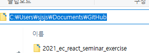
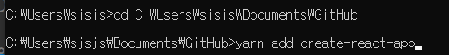
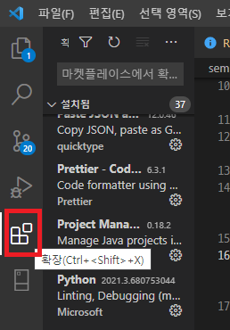
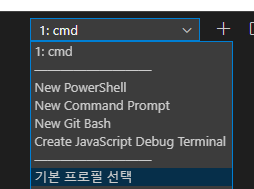

# React Semiar

리액트 세미나 내용 정리입니다.

## 세미나 내용

리액트는 프론트엔드 라이브러리입니다. 프론트엔드란 사용자와 직접 상호작용하고 서버와 상호작용하는 역할을 합니다.
여러분들이 과기대 홈페이지에서 id pw를 입력하고 로그인 버튼을 누르면 과기대 페이지는 서버에 로그인 처리를 요청합니다. 이 때 과기대 홈페이지를 프론트 엔드 라고 할 수 있습니다.

리액트의 인기는 날이 갈수록 높아지고 있습니다. npm trend, 구글 trend를 보면 2016년부터 React는 다른 프론트엔드 라이브러리에 비해 검색량과 설치량이 높은 것을 볼 수 있습니다.

- https://www.npmtrends.com/react-vs-angular-vs-vue
- https://trends.google.com/trends/explore?date=today%205-y&geo=US&q=react,angular,vue

React로 개발한 사이트로는 페이스북 넷플릭스 AWS 우버 티스토리 Airbnb 등등 셀수없이 많은 사이트가 React로 개발되어있습니다.

React를 배우면 웹 사이트를 간단히 개발할 수 있습니다. 뿐만 아니라 Electron으로 데스크탑 앱도 개발할 수 있고 React Native로 모바일 앱(Android, iOS)도 만들 수 있습니다. 배우면 시도할 수 있는 것들이 굉장히 많다는 뜻입니다.

사실 여러분이 리액트를 하든 노드, 안드로이드, 유니티를 하든 상관없이 일단 하나를 파서 열심히 해봤으면 좋겠습니다. 개발자는 끊임없이 뭔가를 만들어야 하는 사람입니다. 지금부터 뭔가를 배우고 생산해나가면 그것이 포트폴리오가 되고 본인의 능력을 증명하게 될 것입니다.
그런 의미에서 리액트는 좋은 선택입니다. 리액트는 빠르게 결과물을 만들어 배포할 수 있고 리액트만 배워도 3가지 환경에서 앱을 만들 수 있게 됩니다. 사용하는 곳도 많고 커뮤니티도 잘 형성되어 있어 배우기도 좋고 오류가 발생하더라도 해결하기가 쉽습니다.

## 실습

### 실습 환경 구축

#### 툴

순서대로 설치해주세요

- 크롬
- Visual Studio Code : https://code.visualstudio.com/
- Node.js : https://nodejs.org/ko/
  - 왼쪽의 14.x 버전을 설치해주세요
- Yarn : cmd에 들어가서 npm install -g yarn 을 하면 yarn이 설치됩니다.
- create-react-app : 이 프로그램은 프로젝트를 만들고자 하는 폴더 안에서 실행해야 합니다. cmd에서 cd [해당폴더의 경로]를 입력해서 해당 경로로 이동해야 합니다.


경로 복사하기

yarn add create-react-app 을 치면 설치가 됩니다.

> 만약 설치에 문제가 생길 경우 npm의 환경변수 설정을 참고해보세요 아니면 카톡이나 메일주세요

#### VS Code 확장 프로그램 설정

visual studio code는 제가 애용하고 있는 코드 에디터입니다. 웹을 개발할 때는 이것만한게 없습니다.

먼저 확장에 들어갑니다.

다음 항목들을 검색해서 설치해줍니다.

- Korean Language Pack for Visual Stu... : 한글 패치를 해줍니다.
- Prettier - Code formatter : 코드를 자동으로 예쁘게 정리해줍니다.
- Live Server : HTML 파일을 코딩할 때 저장하면 자동으로 페이지가 업데이트 되게 해줍니다.
- HTML Snippets : html 태그들을 `<html></html>`을 다 작성할 필요 없이 html만 치고 앤터를 누르면 자동으로 앞의 코드가 완성됩니다.
- Reactjs code snippets : 컴포넌트를 작성할 때 rsi등의 명령어를 이용하면 자동으로 틀이 완성됩니다.
- vscode-icons : 파일의 아이콘을 예쁘게 만들어줍니다.

> 확장 프로그램을 적용할 때는 자동으로 될 때도 있지만 그렇지 않을 경우 ctrl+shift+p를 눌러서 확장 프로그램을 검색하여 실행시켜줘야 합니다.

> 자동완성이 안된다면 ctrl+spacebar를 눌러 보세요

이로써 실습에 필요한 프로그램은 다 설치했습니다. 만약 오류가 생긴다면 카톡이나 메일 주세요. 이제 세미나 영상을 보면서 따라오시면 되겠습니다.

### 순수 HTML 코딩

웹 페이지는 HTML, CSS, JS, ... 으로 이루어져 있습니다.

- html은 웹의 구조와 내용을 정의합니다.
- CSS는 웹페이지의 요소들에 스타일을 정의합니다. 요소의 크기, 색, 위치등을 지정해 줄 수 있습니다.
- js는 웹페이지의 동적인 부분들을 정의해줍니다. 버튼을 눌렀을 때 어떤 동작을 할 지 같은 것들을 정의해 줄 수 있습니다.
- 그 외에 이미지나 폰트 등의 파일도 웹페이지에 포함되어 있습니다.

HTML은 여러 태그들이 트리 구조로

- /seminar/pure_html 폴더에 코드가 있습니다. 흔히 DOM Tree라고 합니다.
  

태그는 `<html></html>`과 같은 구조로 이루어져 있고 태그가 태그를 감싸는 형식으로 이루어져 있습니다.

#### 실습

다음은 실습하면서 작성한 코드입니다.

```html
<!DOCTYPE html>
<html lang="ko">
  <head>
    <title>Document</title>
    <link rel="stylesheet" href="./index.css" />
  </head>
  <body>
    <div class="main">
      
    </div>
    <ul class="nav">
      
      <li>대학 소개</li>
      <li>입학국제교류</li>
      <li>대학대학원</li>
      <li>대학생활</li>
      <li>산학연구</li>
      <li>취업창업</li>
      <li>정보민원서비스</li>
    </ul>
  </body>
</html>
```

코드를 처음부터 보면

- `<!DOCTYPE html>`는 파일의 형식을 나타냅니다. html파일이라는 뜻입니다.
- `<html lang="ko">`는 웹 페이지가 한국어 페이지임을 나타냅니다.
- `<head>`태그 내부에는 제목과 같은 웹페이지의 정보가 들어 있습니다.
- `<title>Document</title>` 웹 페이지의 제목을 Document로 설정합니다.
- `<link rel="stylesheet" href="./index.css">`같은 폴더 내에 있는 css 파일을 불러옴으로써 스타일을 적용시킵니다.
- `<body>`태그는 웹 페이지의 내용을 표현하는 곳입니다. 스타일을 적용하지 않을 시 각 요소들의 크기나 위치 등이 아무것도 정의되지 않았기 때문에 위에서 아래로 나열되게 됩니다.
- `<div class="main">`div 태그는 하나의 박스라고 보시면 됩니다. 여러 태그들을 쭉 나열하는 것 보다는 div 태그로 묶어서 내용을 구조화하는 것이 스타일링 할 때도 좋습니다.
  class는 웹페이지 요소에게 부여할 수 있는 태그같은 거라고 보면 좋을 것 같습니다. 스타일링 할 때 이 class 이름으로 스타일링 할 요소를 선택할 수 있습니다.
- ``img 태그는 이미지를 만들어줍니다. src에는 파일의 주소, alt에는 파일이 존재하지 않을 시 나타나는 텍스트를 정의합니다.
  id는 웹페이지 내부 요소중 하나에 부여할 수 있는 고유한 값입니다. 이를 통해 스타일링이나 js로 동적인 처리를 할 때 필요합니다.
- `<ul class="nav">` ul은 리스트 형식의 내용을 작성하기 위한 태그입니다.
- `<li>대학 소개</li>`li는 리스트 내부의 아이템을 작성할 때 사용하는 태그입니다.

사실 html에는 웹 페이지의 내용물을 잘 구조화해서 작성하기만 하면 되고 진짜 어려운 것은 스타일링입니다.

다음은 실습하면서 작성한 css 코드입니다.

```css
body {
  margin: 0;
}

.main {
  position: relative;
}

#mainImg {
  position: absolute;
  z-index: -1;
}

.nav {
  list-style: none;
  margin: 0 10%;
  padding: 0;
  display: flex;
  flex-direction: row;
  justify-content: center;
  align-items: center;
  background-color: white;
}

.nav li {
  width: 10rem;
  height: 3rem;
  display: flex;
  justify-content: center;
  align-items: center;
  font-weight: bold;
}

.nav li:hover {
  background-color: rgb(13, 23, 82);
  color: white;
}
```

css는 선택자를 이용해 요소를 선택하고 스타일을 지정해 줄 수 있습니다. 여기서부터는 세미나 수준에선 자세히 설명드리긴 힘들 것 같습니다.
대략적인 내용은 css는 요소들을 골라서 그 요소의 크기나 여백을 설정하고, 위치나 요소들끼리 겹쳤을 때 누가 위에 보일 것인가 요소들을 어떻게 정렬할 것인가.
폰트의 크기? 굵기? 색상?, 배경은 어떤색으로 할건지 요소들을 세로로 나열할 것인지 가로로 나열할 것인지 등등 아주 많은 것들이 있습니다.
개인적으로 웹을 처음 배웠을 때는 이 css가 가장 어려웠습니다. 너무 복잡하기 때문입니다. React에선 이 작업을 조금 더 쉽게 할 수 있습니다.

여기까지 HTML, CSS를 맛보기 해 보았고 바로 React 실습을 해보겠습니다.

### React 코딩

React 프로젝트를 만들고자 하는 위치에서 cmd에 yarn create react-app [파일이름] 을 칩니다.
예시) C:\Users\sjsjs\Documents\GitHub>yarn create react-app test
test라는 프로젝트가 C:\Users\sjsjs\Documents\GitHub>이 폴더 내부에 생성됨

그리고 vs code의 파일->폴더열기->프로젝트 폴더 로 해당 프로젝트를 열어줍시다.

ctrl+`을 누르면 cmd창을 볼 수 있을겁니다. 만약 cmd가 아니라 powershell이라면
기본 프로필 선택 -> command prompt를 하시면 바뀔껍니다.


그다음 cmd 창에 yarn start를 쳐보세요 웹 창이 하나 뜨면서 우리의 프로젝트가 실행될 겁니다.

다음 파일은 지금은 필요없으니 삭제해주세요

- public/logo
- public/manifest
- public/robots.txt
- src/logo.svg
- src/reportWebCitals.js
- src/setupTests.js

react에선 코드를 분리하여 작성할 수 있습니다. 이때 만든 js파일 하나를 컴포넌트라고 하는데 React는 이러한 컴포넌트들로 구성되어 있습니다.

컴포넌트는 javascript 문법으로 작성되며 jsx라는 문법을 사용하는데 이는 javascript 파일 내부에서 html 태그처럼 html 요소를 작성할 수 있게 해주는 문법입니다. 이때문에 컴포넌트의 확장자를 jsx로 만들기도 합니다.

하나만 자세히 살펴보자면

```jsx
import "./App.css";
import Content from "./components/Content";
import Home from "./components/Home";

function App() {
  return (
    <div className="app">
      <Home />
      <Content />
    </div>
  );
}

export default App;
```

- `import "./App.css";` css 파일을 현재 파일에 가져옴으로써 스타일링을 해줍니다.
- `import Content from "./components/Content";` components 폴더 내부의 Content 컴포넌트를 이 파일에 불러와서 사용할 수 있도록 합니다. 이때 Content라는 이름으로 코드를 작성하면 사용할 수 있습니다.
- `function App() {` App이라는 함수를 정의합니다.. 이 함수는 리액트 컴포넌트를 반환하는 역할을 합니다.
- `return (` 리액트 컴포넌트를 반환하는 함수입니다.
- `<div className="app">` div 태그를 만들고 class는 app으로 지정합니다. 리액트에서는 className으로 지정해줘야 합니다.
- `<Home />` Home 컴포넌트를 사용합니다.
- `export default App;` 다른 파일에서 이 파일을 불러올 수 있도록 export 해줍니다.

영상 마지막 부분에 github page에 deploy하는 부분이 있습니다. github page는 자신의 소스를 인터넷에 올릴 수 있는 서비스입니다. 다 무료입니다.

- git을 설치합니다. : https://git-scm.com/
- 프로젝트로 가서 yarn add gh-pages를 통해 설치해줍니다.
- github에 리포지토리를 하나 만들어줍니다. 이때 제목과 설명만 적어주고 만듭니다.
- 다음 명령어를 순서대로 쳐줍니다.

```git
git commit -m "first commit"
git remote add origin [리포지토리 주소]
git branch -M main
git push -u origin main
```

- package.json 파일을 수정해줍니다. 제 코드를 한번 참고해보세요

```json
  "homepage": "https://[자신의 아이디].github.io/[프로젝트 이름]/",
  "scripts": {
    ...
    "predeploy": "npm run build",
    "deploy": "gh-pages -d build"
    ...
  }
```

- 그다음 yarn deploy를 입력해줍니다. 그러면 홈페이지 주소로 github-page가 활성화되어 인터넷에 웹사이트가 올라가 있을 겁니다

여기까지 설명드리고 나머지는 영상의 내용을 따라와주시면 됩니다.
영상에서 놓친 부분이 있다면 [여기](react/src)의 코드를 참고해주세요 궁금한게 있으시면 연락 주세요
